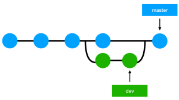

# Инструкция по Git
## 1. Установка и настройка git
1. установить git на компьютер - скачать файл или через терминал
2. настроить учетную запись пользователя, для этого нужно ввести имя и адрес электронной почты:
* git config --global user.name "John Doe"
* git config --global user.email johndoe@example.com
настройка завершена
## 2. Инициализация репозитория
1. нужно создать пустую папку
2. открыть терминал в этой папке
3. ввести комманду git init
## 3. Запись изменений в репозиторий
1. для сохранения изменений надо воспользоваться коммандой git add . или указать конкретный файл git add <name file>
2. для записи изменений нужно воспользоваться коммандой git commit -m "comment" или объеденить с верхней командой введя git commit -am "comment"
## 4. Получение информации об истории коммита
1. для получения информации об истории коммитов надо ввести комманду git log
2. для получения списком в одну строчку надо добавить git log --oneline
## 5. Сравнение с последним коммитом
для сравнения изменений с последним коммитом надо ввести комманду:
* git diff
## 6. Перемещение между сохранениями
для перемещения между коммитами надо воспользоваться коммандой
* git checkout <номер коммита, можно только первые 4 символа>

**#Работа с ветками**
Чтобы создать новую ветку - git branch branch_name

## 7. Создание и переключение ветки
(будет мини конфликт)

Чтобы создать новую ветку и переключиться на неё надо ввести команду

**git checkout -b <name_branch>**

## 8. Объединение веток
Чтобы объединить две ветки надо
1. Переключиться на нужную ветку git checkout <name_branch>
2. Выполнить комманду merge с указанием ветки для слияния git merge <name_another_branch>

## 9. Удаление ветки
Чтобы удалить ветку над ввести:
* git branch -d <name_branch>
